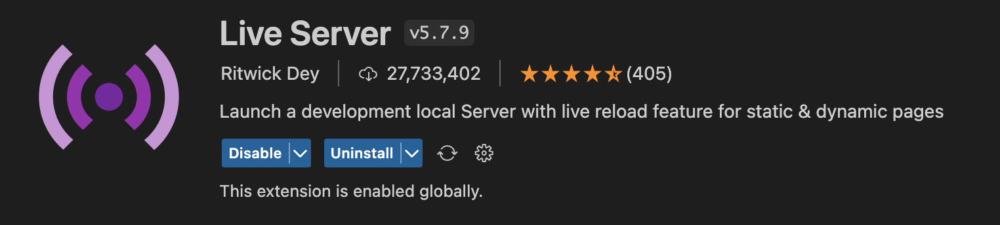

<a id="readme-top"></a>

<br>

<!-- table of contents -->
<details>
  <summary>Table of Contents</summary>
  <ol>
    <li><a href="#installation">How do I install Home:Bound?</a></li>
    <li><a href="#running">How do I run Home:Bound?</a></li>
  </ol>
</details>

<br>

<hr>

<br>

<a id="installation"></a>

# Installation

<br>

1. Download and install <a href="https://code.visualstudio.com/download">Visual Studio Code</a>.

2. Download and install <a href="https://desktop.github.com/">Github Desktop</a>.

3. Download and install git.
  ```
  npm install -g git
  ```

4. Clone the Home:Bound repository.
  ```sh
   git clone https://github.com/kelsieee/home-bound.git
  ```

5. Launch GitHub Desktop and select the home-bound repository. 

6. Install the Live Server extension on Visual Studio Code (extension ID: ritwickdey.LiveServer).
  <br>
  
  <br>

7. Launch <strong>newlanding.html</strong> using the Live Server (right click on the file > "Open with Live Server" option) and you're good to go! 

<br>

<a id="running"></a>

# Running

<p align="right">(<a href="#readme-top">back to top</a>)</p>

You don't have to do anything! Just visit this <a href="https://home-bound.vercel.app/newlanding.html">link</a> for our <strong>live website</strong>!

<br><br>
